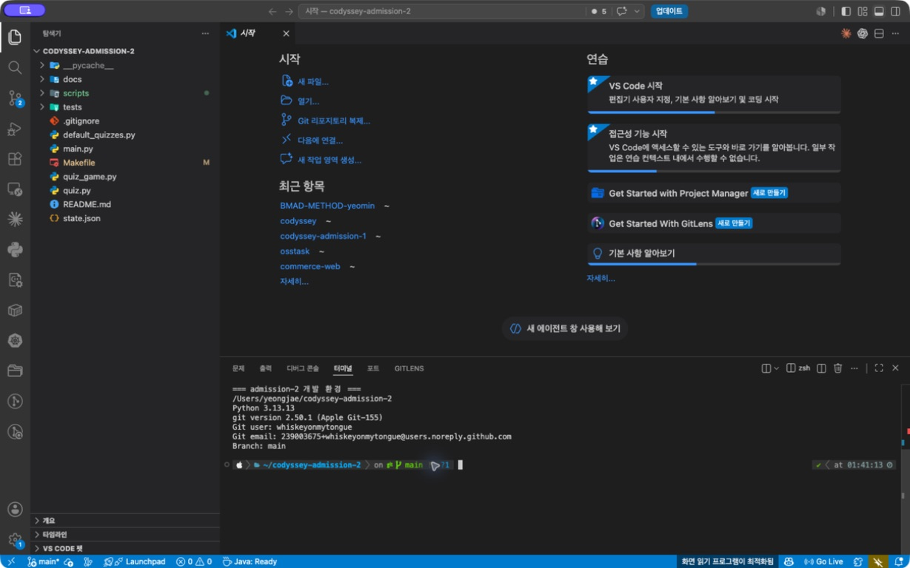
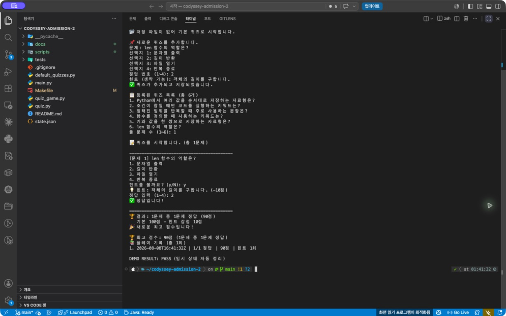
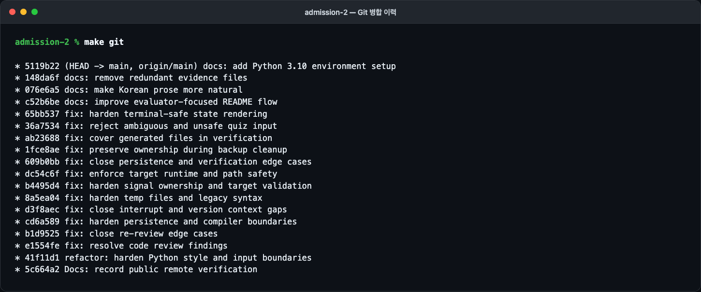
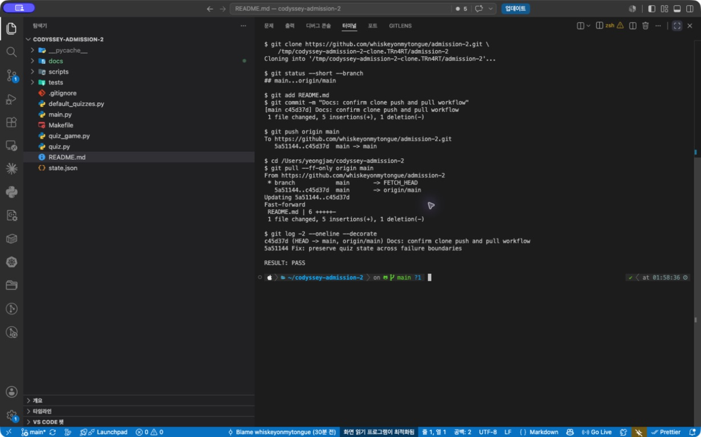

# Python 기초 퀴즈

터미널에서 퀴즈를 등록하고 풀 수 있는 Python 콘솔 프로그램입니다. 프로그램을
종료해도 퀴즈, 최고 점수와 플레이 기록이 `state.json`에 남습니다.

퀴즈 주제는 **Python 기초 문법**입니다. 이번 과제에서 직접 사용하는 자료형,
조건문, 반복문, 함수와 딕셔너리를 문제로 만들면 코드를 작성하는 과정과 개념
복습을 한 흐름으로 연결할 수 있어 이 주제를 선택했습니다.

## 바로 실행하기

Python 3.10 이상과 Git만 있으면 됩니다. 외부 패키지는 사용하지 않습니다.

```bash
git clone https://github.com/whiskeyonmytongue/admission-2.git
cd admission-2
python3 main.py
```

메뉴에서 `1`부터 `6`까지 입력합니다.

```text
1. 퀴즈 풀기
2. 퀴즈 추가
3. 퀴즈 목록
4. 점수 확인
5. 퀴즈 삭제
6. 종료
```

숫자 입력의 앞뒤 공백은 제거합니다. 빈 값, 문자, 허용 범위 밖 숫자는 이유를
알려 주고 다시 입력받습니다. `Ctrl+C`나 EOF가 발생해도 가능한 상태를 저장한
뒤 traceback 없이 종료합니다. 저장에 실패해 종료할 수 없는 경우에는 진단을
표준 오류(`stderr`)로 출력하고 종료 코드 `1`을 반환합니다.

`main.py`를 다른 디렉터리에서 실행해도 기본 저장 위치는 항상 이 프로젝트의
`state.json`입니다. 별도 상태가 필요하면 `QUIZ_STATE_PATH` 환경 변수로 경로를
바꿀 수 있습니다.

## 구현 기능

| 구분 | 구현 내용 | 확인 위치 |
|---|---|---|
| 기본 퀴즈 | 직접 작성한 Python 기초 문제 5개 | `default_quizzes.py`, `state.json` |
| 퀴즈 풀기 | 출제, 1~4 입력 검증, 정답 판정, 결과 출력 | `QuizGame.play_quiz()` |
| 퀴즈 관리 | 추가, 목록 조회, 삭제 즉시 저장 | `add_quiz()`, `list_quizzes()`, `delete_quiz()` |
| 점수 | 최고 점수와 정답 수 저장·조회 | `show_score()` |
| 파일 복구 | 파일 없음은 기본값 생성, 손상 파일은 백업 후 복구 | `load_state()` |
| 안전 저장 | 임시 파일 기록 후 `os.replace()`로 원자 교체 | `save_state()` |
| 보너스 1 | `random.shuffle()`로 문제 순서 무작위화 | `play_quiz()` |
| 보너스 2 | 전체 문제 범위 안에서 풀 문제 수 선택 | `play_quiz()` |
| 보너스 3 | 실제 힌트 한 번당 10점 감점, 빈 힌트는 감점 없음 | `_offer_hint()` |
| 보너스 4 | 퀴즈 삭제와 저장 실패 시 메모리 복구 | `delete_quiz()` |
| 보너스 5 | ISO 8601 시각·문제 수·정답 수·점수 기록 | `history` |

## 코드 구조와 실행 흐름

```text
main.py
  └─ QuizGame 생성
       ├─ state.json 불러오기 또는 기본값 복구
       ├─ 메뉴 입력과 기능 실행
       ├─ Quiz 객체로 문제와 정답 판정 관리
       └─ 변경된 상태를 state.json에 원자적으로 저장
```

- `Quiz`는 문제 한 개의 데이터 검증, 표시 형식과 정답 판정을 담당합니다.
- `QuizGame`은 입력 검증, 메뉴, 게임 진행과 파일 입출력을 담당합니다.
- `calculate_score()`는 정답 수와 유효한 힌트 수만 받아 점수를 계산합니다.
- 역할을 나눠 문제 형식 변경은 `Quiz`, 게임 규칙 변경은 `QuizGame`부터 확인할
  수 있습니다.

`if/elif`는 선택한 메뉴에 따라 실행할 기능을 나누고, `while`은 올바른 입력을
받을 때까지 반복합니다. `for`는 문제와 선택지처럼 개수가 정해진 데이터를
차례대로 처리합니다. 메서드의 매개변수로 입력을 받고 반환값으로 검증 결과를
전달하므로 입력·게임·저장 로직이 한 함수에 섞이지 않습니다.

## `state.json` 설명

프로젝트 루트의 UTF-8 JSON 파일이며 구조는 다음과 같습니다.

```json
{
  "quizzes": [
    {
      "question": "문제",
      "choices": ["보기 1", "보기 2", "보기 3", "보기 4"],
      "answer": 1,
      "hint": "힌트"
    }
  ],
  "best_score": 90,
  "best_result": {"correct": 1, "total": 1},
  "history": [
    {
      "played_at": "2026-08-09T00:00:00Z",
      "total": 1,
      "correct": 1,
      "score": 90,
      "hints_used": 1
    }
  ]
}
```

JSON은 사람이 읽을 수 있고 Python의 `dict`와 `list`를 그대로 표현하기 쉬워
선택했습니다. 읽기·쓰기에는 파일 부재, 권한 오류, 잘못된 JSON 같은 실패가
생길 수 있어 `try/except`로 처리합니다. 손상된 원본은
`state.json.corrupt-<UTC 시각>.bak`으로 보존한 뒤 기본 퀴즈로 복구합니다.

퀴즈가 수천 개로 늘어나면 매번 전체 JSON을 읽고 쓰는 비용과 동시 수정 문제가
커집니다. 그런 규모에서는 문제와 기록을 개별 조회·갱신할 수 있는 SQLite 같은
데이터베이스가 더 적합합니다.

## 파일 구조

```text
.
├── main.py                    # 실행 진입점
├── quiz.py                    # Quiz 클래스
├── quiz_game.py               # QuizGame 클래스와 전체 기능
├── default_quizzes.py         # 기본 퀴즈 5개
├── state.json                 # 퀴즈·점수·히스토리
├── tests/                     # unittest 자동 테스트
├── scripts/                   # 스타일·Git·원격 검증 스크립트
├── docs/evidence/             # 실제 실행 로그와 화면
├── Makefile                   # 반복 가능한 검증 명령
└── README.md
```

## 자동 검증

```bash
make env
make demo
make git
make syntax
make style
make test
make verify
```

`make env`는 실행 환경, `make demo`는 핵심 기능 전체, `make git`은 브랜치·병합
이력을 보여 줍니다. `make verify`는 Python 3.10 문법, 스타일, 42개 단위 테스트,
임시 상태를 이용한 CLI 안전 종료를 차례로 확인합니다. 시연과 테스트는
`tempfile` 아래의 상태만 사용하므로 제출용 `state.json`을 변경하지 않습니다.

스타일 검사는 외부 패키지 없이 `ast`, `tokenize`, `pathlib` 등 표준 라이브러리만
사용합니다. UTF-8, LF, 마지막 개행, 줄 끝 공백, 4칸 들여쓰기, 코드 79자,
주석·docstring 72자, 공개 API docstring, Python 3.10 AST·컴파일 문맥과 함수
50줄 제한을 검사합니다. 위반하면 `파일:줄` 형식으로 원인을 출력하고 실패합니다.

원격 작업까지 끝난 뒤에는 다음 명령으로 Git 요구사항과 공개 저장소 상태를
확인할 수 있습니다.

```bash
make verify-git
make verify-remote
```

## Git 작업 기록

기능 단위로 커밋했으며, 퀴즈 풀기는 `feature/play-quiz` 브랜치에서 구현한 뒤
`git merge --no-ff`로 `main`에 병합했습니다.

| 명령 | 이 프로젝트에서의 역할 |
|---|---|
| `git init` | 로컬 저장소 생성 |
| `git add` | 다음 커밋에 포함할 변경 선택 |
| `git commit` | 기능 단위 변경 이력 저장 |
| `git checkout` | 플레이 기능 브랜치 생성·전환 |
| `git merge` | 플레이 브랜치를 `main`에 병합 |
| `git push` | 로컬 커밋을 GitHub에 전송 |
| `git clone` | GitHub 저장소를 별도 디렉터리에 복제 |
| `git pull` | 복제본의 변경을 기존 디렉터리에 반영 |

브랜치는 아직 완성되지 않은 기능을 `main`과 분리해 작업하고 검증할 수 있게
합니다. 병합은 분리된 이력을 한 기준 브랜치에 합치는 작업입니다.

이 문단은 GitHub에서 별도 clone한 작업 디렉터리에서 추가해 push한 뒤, 최초
작업 디렉터리에서 `git pull --ff-only`로 받아왔습니다. 따라서 아래 로그는 명령
설명만 적은 예시가 아니라 두 작업 디렉터리 사이의 실제 왕복 기록입니다.

실제 확인 자료:

- [개발 환경 로그](docs/evidence/logs/environment.txt)
- [추가·목록·플레이·점수 실행 로그](docs/evidence/logs/app-workflow.txt)
- [브랜치 병합 그래프](docs/evidence/logs/git-history.txt)
- [자동 테스트와 검증 결과](docs/evidence/logs/verification.txt)
- [clone → commit → push → pull 로그](docs/evidence/logs/clone-pull.txt)

## 실제 실행 화면

### 1. 실행 환경



### 2. 추가·목록·풀이·점수



방금 추가한 여섯 번째 문제를 풀어 정답 1개, 힌트 1회, 최종 90점과 ISO 시각
기록이 한 화면에 남는 것을 확인할 수 있습니다.

### 3. 브랜치와 병합 이력



`feature/play-quiz`의 두 기능 커밋이 `61a6736` 병합 커밋을 통해 `main`으로
합쳐진 구조입니다.

### 4. 실제 clone→push→pull



별도 clone의 `c45d37d` 커밋을 GitHub에 push한 뒤 원본 작업 디렉터리에서
fast-forward pull했습니다. 같은 명령과 출력은
[텍스트 로그](docs/evidence/logs/clone-pull.txt)에서도 복사해 확인할 수 있습니다.
