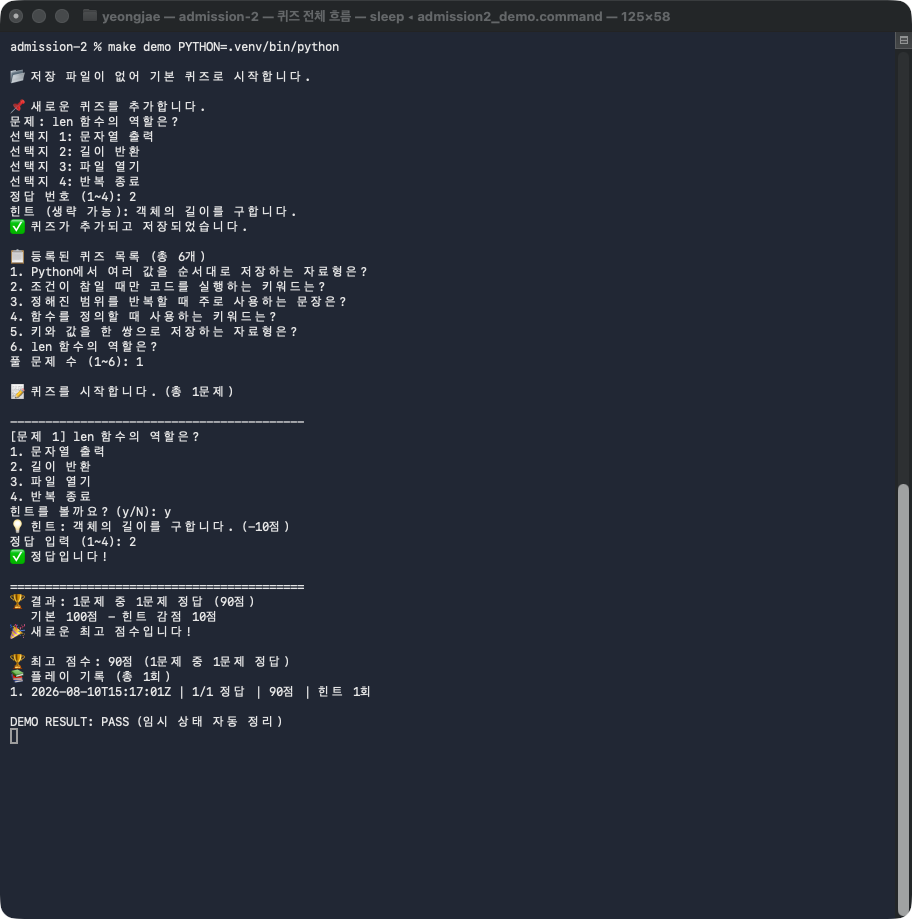
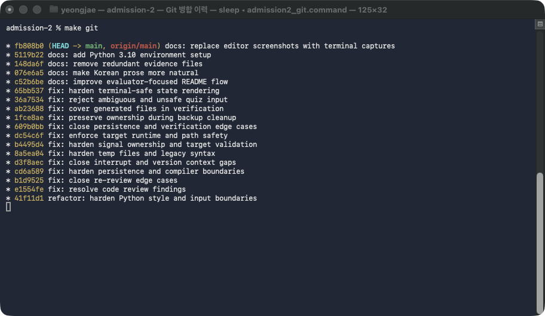
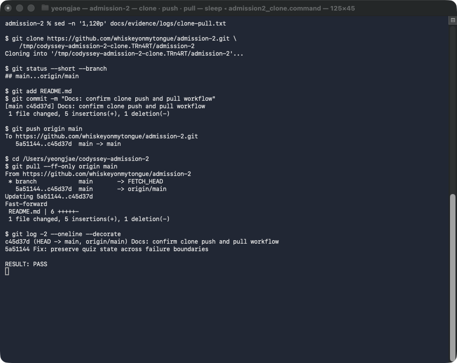
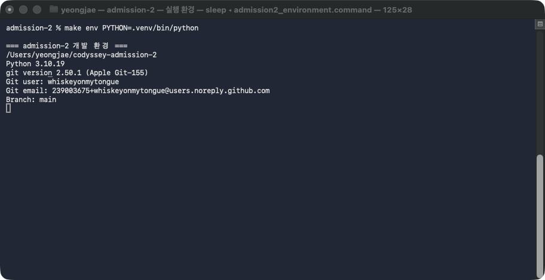

# 컴퓨터에게 명령 내리는 말(파이썬) 처음 배우기

[](https://github.com/whiskeyonmytongue/admission-2/actions/workflows/verify.yml)

터미널에서 퀴즈를 등록하고 푸는 Python 콘솔 프로그램입니다. 프로그램을
종료한 뒤에도 퀴즈와 최고 점수, 플레이 기록은 프로젝트 루트의 `state.json`에
남아 있습니다.

퀴즈 주제는 **Python 기초 문법**입니다. 프로그램을 만들며 사용한 자료형,
조건문, 반복문, 함수와 딕셔너리를 곧바로 문제로 복습하기 좋아 이 주제를
선택했습니다.

## 실행 방법

Python 3.10 이상과 Git만 준비하면 됩니다. 외부 패키지는 필요하지 않습니다.

### Python 3.10이 없는 환경

`venv`는 이미 설치된 Python으로 가상환경을 만들기 때문에 Python 3.10 자체가
없다면 먼저 해당 버전을 준비해야 합니다. 이 저장소는 `uv`를 이용해 Python
3.10과 `.venv`를 한 번에 구성할 수 있습니다.

macOS에서는 Homebrew로 `uv`를 설치할 수 있습니다.

```bash
brew install uv
```

macOS 또는 Linux에서 Homebrew를 사용하지 않는다면 공식 설치 스크립트를
사용합니다.

```bash
curl -LsSf https://astral.sh/uv/install.sh | sh
export PATH="$HOME/.local/bin:$PATH"
```

저장소를 내려받은 뒤 가상환경을 만들고 전체 검증을 실행합니다.

```bash
git clone https://github.com/whiskeyonmytongue/admission-2.git
cd admission-2
make setup
make verify-venv
```

`make setup`은 최신 Python 3.10 패치 버전을 내려받아 `.venv`를 만듭니다.
`make verify-venv`는 가상환경을 직접 활성화하지 않아도 `.venv/bin/python`으로
전체 검증을 실행합니다.

프로그램을 직접 실행하려면 가상환경을 활성화합니다.

```bash
source .venv/bin/activate
python main.py
deactivate
```

`uv` 설치 방법은 [공식 설치 문서](https://docs.astral.sh/uv/getting-started/installation/)에서,
Python 버전 관리 방식은 [공식 Python 관리 문서](https://docs.astral.sh/uv/guides/install-python/)에서
확인할 수 있습니다.

### Python 3.10이 이미 있는 환경

```bash
git clone https://github.com/whiskeyonmytongue/admission-2.git
cd admission-2
python3 main.py
```

프로그램을 실행하면 `1`부터 `6`까지 원하는 기능을 고릅니다.

```text
1. 퀴즈 풀기
2. 퀴즈 추가
3. 퀴즈 목록
4. 점수 확인
5. 퀴즈 삭제
6. 종료
```

숫자 앞뒤의 공백은 자동으로 지웁니다. 빈 값이나 문자, 허용 범위를 벗어난
숫자가 들어오면 오류 원인을 보여 주고 다시 입력받습니다. `Ctrl+C`나 EOF가
발생하면 가능한 상태까지 저장하고 traceback 없이 종료합니다.

## 구현한 기능

### 필수 기능

| 기능 | 구현 내용 | 확인 위치 |
|---|---|---|
| 기본 퀴즈 | 직접 만든 Python 기초 문제 5개 제공 | `default_quizzes.py`, `state.json` |
| 퀴즈 풀기 | 문제 출제, 1~4 범위 입력 검사, 정답 판정과 결과 안내 | `QuizGame.play_quiz()` |
| 퀴즈 관리 | 문제를 추가·조회·삭제하고 변경 즉시 저장 | `add_quiz()`, `list_quizzes()`, `delete_quiz()` |
| 점수 | 최고 점수와 정답 수를 저장해 다시 조회 | `show_score()` |
| 파일 복구 | 파일이 없으면 기본값 생성, 손상됐으면 백업 후 복구 | `load_state()` |
| 안전 저장 | 임시 파일에 먼저 기록하고 `os.replace()`로 원자 교체 | `save_state()` |
| 입력 안전성 | 중복 JSON 키, 위험한 출력 문구와 시각 형식을 차단 | `load_state()`, `Quiz` |

### 보너스 기능

| 기능 | 구현 내용 |
|---|---|
| 랜덤 출제 | `random.shuffle()`로 매번 문제 순서를 변경 |
| 문제 수 선택 | 등록된 문제 중 이번에 풀 개수를 직접 지정 |
| 힌트 | 실제로 본 힌트마다 10점 감점, 빈 힌트는 감점 제외 |
| 퀴즈 삭제 | 삭제 직후 저장하고 저장에 실패하면 메모리 상태 복구 |
| 플레이 기록 | ISO 8601 시각과 문제 수·정답 수·점수를 함께 저장 |

## 실행 화면



여섯 번째 문제를 추가하고 그중 한 문제를 풀었습니다. 힌트를 한 번 사용해
10점이 차감됐으며 최종 점수 90점과 플레이 시각이 함께 저장됐습니다.

## 코드 구조와 실행 흐름

```text
main.py
  └─ QuizGame 생성
       ├─ state.json 불러오기 또는 기본값 복구
       ├─ 메뉴 입력과 기능 실행
       ├─ Quiz 객체로 문제와 정답 판정 관리
       └─ 변경된 상태를 state.json에 원자적으로 저장
```

- `Quiz`는 문제 한 개의 데이터 검증과 표시 형식, 정답 판정을 맡습니다.
- `QuizGame`은 입력 검증과 메뉴, 게임 진행, 파일 입출력을 맡습니다.
- `calculate_score()`는 정답 수와 실제로 사용한 힌트 수를 바탕으로 점수를
  계산합니다.

### 클래스를 사용한 이유

`Quiz`는 문제, 선택지, 정답, 힌트라는 **상태**와 그 상태를 검증하고 판정하는
**동작**을 한 객체에 묶습니다. 덕분에 여러 함수에 딕셔너리를 반복해서 넘기거나
각 함수가 같은 검증을 되풀이하지 않아도 되고, 생성된 `Quiz`는 항상 유효한
형식을 유지합니다. `QuizGame`도 퀴즈 목록, 점수, 저장 경로처럼 여러 메뉴가
공유하는 상태를 보관하므로 전역 변수나 긴 매개변수 목록 없이 기능을 나눌 수
있습니다. 반대로 상태를 기억할 필요가 없는 점수 계산은 클래스로 만들지 않고
순수 함수 `calculate_score()`로 두었습니다. 즉, **지속해서 함께 관리할 데이터와
동작에는 클래스를, 입력을 받아 결과만 반환하는 계산에는 함수를 사용했습니다.**

`if/elif`는 메뉴 선택에 따라 실행할 기능을 나눕니다. `while`은 올바른 값이
들어올 때까지 입력을 반복하고 `for`는 문제와 선택지를 차례로 처리합니다.
문제 형식은 `Quiz`, 게임 규칙은 `QuizGame`에 모아 두어 수정할 위치도 쉽게
찾을 수 있습니다.

## `state.json` 구조

`state.json`은 프로젝트 루트에 저장하는 UTF-8 JSON 파일입니다.

```json
{
  "quizzes": [
    {
      "question": "문제",
      "choices": ["보기 1", "보기 2", "보기 3", "보기 4"],
      "answer": 1,
      "hint": "힌트"
    }
  ],
  "best_score": 90,
  "best_result": {"correct": 1, "total": 1},
  "history": [
    {
      "played_at": "2026-08-09T00:00:00Z",
      "total": 1,
      "correct": 1,
      "score": 90,
      "hints_used": 1
    }
  ]
}
```

JSON을 선택한 이유는 사람이 읽기 쉽고 Python의 `dict`와 `list` 구조를 그대로
옮길 수 있기 때문입니다. 파일을 읽거나 쓸 때 생기는 오류는 `try/except`로
처리했습니다.

### 저장·복구 방식

- 파일이 없을 때는 기본 퀴즈 5개를 담은 새 `state.json`을 만듭니다.
- 손상된 파일은 `.quiz-corrupt-<해시>-<UTC 시각>.bak`으로 원본을 보존한 다음
  기본 상태로 되돌립니다.
- 저장할 내용은 같은 디렉터리의 임시 파일에 먼저 쓰고 `os.replace()`로
  교체합니다.
- 중복 JSON 키와 터미널 제어 문자, UTF-8로 출력할 수 없는 Unicode
  surrogate는 받지 않습니다.
- 플레이 시각은 `T` 구분자와 시간대가 들어간 ISO 8601 형식만 받습니다.

`main.py`를 어느 디렉터리에서 실행하더라도 기본 저장 위치는 이 프로젝트의
`state.json`입니다. 별도의 상태 파일을 쓰려면 `QUIZ_STATE_PATH` 환경 변수에
경로를 지정하면 됩니다.

종료 전에 상태를 저장하지 못하면 원인을 표준 오류(`stderr`)로 출력하고 종료
코드 `1`을 반환합니다. 임시 파일을 만드는 동안 발생한 `Ctrl+C`도
`pthread_sigmask`를 제공하는 macOS와 Linux에서는 원자적으로 처리합니다.
Windows는 검증 범위에서 제외했습니다.

퀴즈가 수천 개로 늘어나면 매번 JSON 전체를 읽고 쓰는 비용이 커지고 동시 수정도
어려워집니다. 그 정도 규모라면 개별 레코드를 조회하고 갱신하는 SQLite 같은
데이터베이스가 더 알맞습니다.

## 자동 검증

아래 명령 하나면 전체 검증이 끝납니다.

```bash
make verify PYTHON=python3.10
```

Python 3.10 확인을 시작으로 전체 Python 파일의 문법과 스타일 검사, 단위
테스트, 임시 상태를 이용한 CLI 안전 종료까지 차례로 실행됩니다. 테스트
데이터는 `tempfile` 아래에서만 만들기 때문에 제출용 `state.json`은 바뀌지
않습니다.

필요한 항목만 따로 검사할 때는 아래 명령을 사용합니다.

| 명령 | 확인 내용 |
|---|---|
| `make setup` | `uv`로 Python 3.10과 `.venv` 구성 |
| `make verify-venv` | `.venv`의 Python 3.10으로 전체 검증 |
| `make env` | Python·Git 버전과 현재 브랜치 확인 |
| `make demo` | 추가·목록·풀이·점수 흐름을 한 번에 재현 |
| `make git` | 브랜치와 병합 그래프 출력 |
| `make verify-git` | 커밋·병합·clone/pull 기록 검사 |
| `make verify-remote` | PUBLIC/main과 로컬·원격 HEAD 일치 검사 |

스타일 검사 역시 표준 라이브러리만 사용합니다. UTF-8, LF, 마지막 개행, 줄 끝
공백, 4칸 들여쓰기, 코드 79자, 주석과 docstring 72자, 공개 API docstring,
Python 3.10 문법과 함수 50줄 제한을 검사합니다. GitHub Actions에서 쓰는 공식
Action은 검토를 마친 커밋 SHA로 고정했습니다.

## Git 이력

### 커밋 단위와 메시지 규칙

커밋 하나에는 나중에 독립적으로 이해하고 되돌릴 수 있는 변경 한 가지를
담았습니다. 기능 구현·테스트·문서·빌드 설정은 목적이 다르면 별도 커밋으로
나누고, 한 변경을 이해하는 데 꼭 필요한 파일만 함께 묶었습니다. 커밋 전에는
변경 파일을 `git diff --staged`로 확인하고 해당 기능의 테스트를 실행했습니다.

메시지는 `<type>: <한 줄 요약>` 형식을 사용했습니다. 제목만 읽어도 변경
목적이 드러나도록 작성하고, `feat`, `fix`, `test`, `docs`, `refactor`,
`build`, `chore`, `merge` 중 알맞은 type을 붙입니다. type은 소문자로,
한 줄 요약은 영어로 통일합니다.

```text
feat: implement Quiz model and input validation
test: cover state recovery, input boundaries, and bonus features
docs: document usage, design decisions, and evidence
merge: integrate feature/play-quiz into main
```

| 요구사항 | 결과 | 증거 |
|---|---:|---|
| 의미 있는 커밋 10개 이상 | 33개 이상 PASS | `make verify-git` |
| 추가 브랜치 생성·병합 | no-ff 병합 PASS | `feature/play-quiz`, `df94a75` |
| clone과 pull 실습 | PASS | [왕복 로그](docs/evidence/logs/clone-pull.txt) |
| 공개 저장소와 `main` | PASS | `make verify-remote` |

### 브랜치와 병합 전략

`main`은 실행과 검증이 끝난 통합 상태로 유지하고, 완성 전 변경이 기본 흐름에
섞이지 않도록 퀴즈 풀기 기능을 `feature/play-quiz` 브랜치에서 구현했습니다.
브랜치에서 출제·채점 기능과 랜덤 출제·힌트 기능을 두 커밋으로 나눠 구현한 뒤
검증하고 `main`으로 돌아와 `git merge --no-ff`로 병합했습니다. 두 기능
커밋은 각각 `7422c29`, `529baf6`입니다.

```text
main에서 feature/play-quiz 생성
  → 기능별 구현·커밋
  → 브랜치에서 검증
  → main으로 전환
  → --no-ff 병합
```

병합은 별도 작업 흐름에서 완성한 변경을 `main`의 이력과 내용에 합치는
과정입니다. `--no-ff`를 사용하면 단순히 브랜치 포인터만 이동하지 않고 병합
커밋 `df94a75`를 남기므로, 기능이 어느 두 커밋에서 개발됐고 언제 `main`에
통합됐는지를 그래프에서 한눈에 확인할 수 있습니다.



저장소를 별도 디렉터리에 clone해 README를 수정하고 push했습니다. 이후 처음
작업하던 디렉터리에서 `git pull --ff-only`로 변경 사항을 받아왔습니다.



<details>
<summary>이 프로젝트에서 사용한 Git 명령</summary>

| 명령 | 역할 |
|---|---|
| `git init` | 로컬 저장소 생성 |
| `git add` | 다음 커밋에 포함할 변경 선택 |
| `git commit` | 기능 단위 변경 이력 저장 |
| `git checkout` | 플레이 기능 브랜치 생성·전환 |
| `git merge` | 플레이 브랜치를 `main`에 병합 |
| `git push` | 로컬 커밋을 GitHub에 전송 |
| `git clone` | GitHub 저장소를 별도 디렉터리에 복제 |
| `git pull` | 원격 변경을 기존 디렉터리에 반영 |

</details>

## 프로젝트 구성

```text
.
├── main.py                    # 실행 진입점
├── quiz.py                    # Quiz 클래스
├── quiz_game.py               # QuizGame 클래스와 전체 기능
├── default_quizzes.py         # 기본 퀴즈 5개
├── state.json                 # 퀴즈·점수·플레이 기록
├── tests/                     # unittest 자동 테스트
├── scripts/                   # 스타일·Git·원격 검증
├── .github/workflows/         # Python 3.10 CI
├── docs/evidence/images/      # 제출용 실행 화면
├── docs/evidence/logs/        # clone·push·pull 실습 증거
├── Makefile                   # 반복 가능한 검증 명령
└── README.md
```

## 참고 자료

아래 화면은 `uv`로 만든 `.venv`에서 Python 3.10과 Git 정보를 확인한 실제
터미널 출력입니다.


